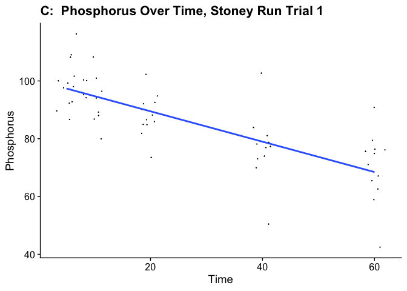
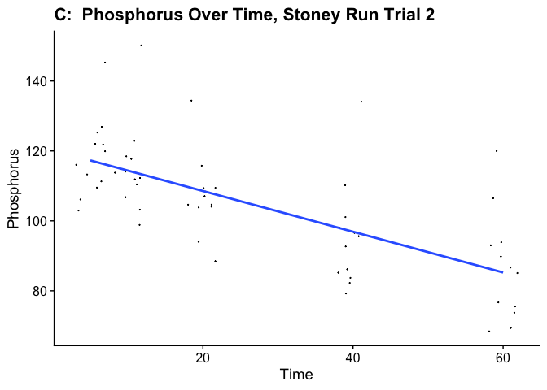
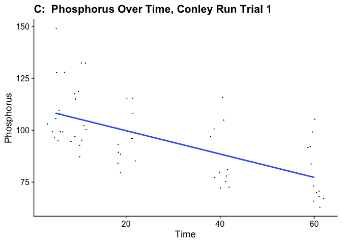
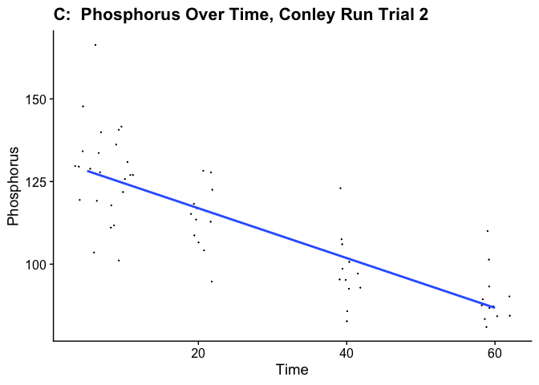

Group Project 1
================
Group 1
9 Feb 2022

``` r
knitr::opts_chunk$set(echo = TRUE)
```

## Target Audience

##### Target audiance is any ecology/biology student who has taken field data, the goal is to clean up field data so it is in a useable form for analysis, and determine if trials are interacting or not.

``` r
summer21_data <- read.csv(file = 'SUMMERDATAFINAL.csv')
print(summer21_data)
```

    ##       Location Trial     Label Time Absorbance Phosphorus
    ## 1   Stoney Run     1     High1    5      0.597   92.72561
    ## 2   Stoney Run     1    High 1   10      0.567   88.07149
    ## 3   Stoney Run     1    High 1   20      0.527   81.86599
    ## 4   Stoney Run     1    High 1   40      0.450   69.92041
    ## 5   Stoney Run     1    High 1   60      0.374   58.84465
    ## 6   Stoney Run     1    High 2    5      0.558   86.67525
    ## 7   Stoney Run     1    High 2   10      0.515   80.00434
    ## 8   Stoney Run     1    High 2   20      0.473   73.48857
    ## 9   Stoney Run     1    High 2   40      0.320   50.41374
    ## 10  Stoney Run     1    High 2   60      0.269   42.45121
    ## 11  Stoney Run     1    High 3    5      0.697  108.23930
    ## 12  Stoney Run     1    High 3   10      0.645  100.17220
    ## 13  Stoney Run     1    High 3   20      0.610   94.74239
    ## 14  Stoney Run     1    High 3   40      0.492   77.26776
    ## 15  Stoney Run     1    High 3   60      0.398   62.59173
    ## 16  Stoney Run     1  Medium 1    5      0.631   98.00028
    ## 17  Stoney Run     1  Medium 1   10      0.606   94.12184
    ## 18  Stoney Run     1  Medium 1   20      0.557   86.52011
    ## 19  Stoney Run     1  Medium 1   40      0.476   73.95399
    ## 20  Stoney Run     1  Medium 1   60      0.421   65.42143
    ## 21  Stoney Run     1  Medium 2    5      0.702  109.01500
    ## 22  Stoney Run     1  Medium 2   10      0.650  100.94790
    ## 23  Stoney Run     1  Medium 2   20      0.596   92.57047
    ## 24  Stoney Run     1  Medium 2   40      0.522   81.09031
    ## 25  Stoney Run     1  Medium 2   60      0.490   76.12591
    ## 26  Stoney Run     1  Medium 3    5      0.655  101.72360
    ## 27  Stoney Run     1  Medium 3   10      0.646  100.32730
    ## 28  Stoney Run     1  Medium 3   20      0.568   88.22662
    ## 29  Stoney Run     1  Medium 3   40      0.507   78.76324
    ## 30  Stoney Run     1  Medium 3   60      0.457   71.00638
    ## 31  Stoney Run     1     Low 1    5      0.644  100.01710
    ## 32  Stoney Run     1     Low 1   10      0.606   94.12184
    ## 33  Stoney Run     1     Low 1   20      0.553   85.89956
    ## 34  Stoney Run     1     Low 1   40      0.470   73.02316
    ## 35  Stoney Run     1     Low 1   60      0.432   67.12794
    ## 36  Stoney Run     1     Low 2    5      0.749  116.30650
    ## 37  Stoney Run     1     Low 2   10      0.697  108.23930
    ## 38  Stoney Run     1    Low  2   20      0.659  102.34410
    ## 39  Stoney Run     1     Low 2   40      0.661  102.65440
    ## 40  Stoney Run     1     Low 2   60      0.585   90.86396
    ## 41  Stoney Run     1     Low 3    5      0.639   99.24138
    ## 42  Stoney Run     1     Low 3   10      0.613   95.20781
    ## 43  Stoney Run     1    Low  3   20      0.593   92.10506
    ## 44  Stoney Run     1     Low 3   40      0.495   76.90160
    ## 45  Stoney Run     1     Low 3   60      0.487   75.66050
    ## 46  Stoney Run     1 Control 1    5      0.629   97.69000
    ## 47  Stoney Run     1 Control 1   10      0.621   96.44891
    ## 48  Stoney Run     1 Control 1   20      0.580   90.08827
    ## 49  Stoney Run     1 Control 1   40      0.540   83.88278
    ## 50  Stoney Run     1 Control 1   60      0.511   79.38379
    ## 51  Stoney Run     1 Control 2    5      0.594   92.26020
    ## 52  Stoney Run     1 Control 2   10      0.574   89.15745
    ## 53  Stoney Run     1 Control 2   20      0.547   84.96874
    ## 54  Stoney Run     1 Control 2   40      0.507   78.76324
    ## 55  Stoney Run     1 Control 2   60      0.492   76.43618
    ## 56  Stoney Run     1 Control 3    5      0.577   89.62286
    ## 57  Stoney Run     1 Control 3   10      0.559   86.83039
    ## 58  Stoney Run     1 Control 3   20      0.546   84.81360
    ## 59  Stoney Run     1 Control 3   40      0.503   78.14270
    ## 60  Stoney Run     1 Control 3   60      0.482   74.88481
    ## 61  Stoney Run     2     High1    5      0.785  125.21450
    ## 62  Stoney Run     2    High 1   10      0.703  111.93690
    ## 63  Stoney Run     2    High 1   20      0.658  104.65040
    ## 64  Stoney Run     2    High 1   40      0.538   85.21973
    ## 65  Stoney Run     2    High 1   60      0.467   73.72324
    ## 66  Stoney Run     2    High 2    5      0.667  106.10770
    ## 67  Stoney Run     2    High 2   10      0.705  112.26080
    ## 68  Stoney Run     2    High 2   20      0.658  104.65040
    ## 69  Stoney Run     2    High 2   40      0.544   86.19126
    ## 70  Stoney Run     2    High 2   60      0.440   69.35134
    ## 71  Stoney Run     2    High 3    5      0.688  109.50810
    ## 72  Stoney Run     2    High 3   10      0.649  103.19310
    ## 73  Stoney Run     2    High 3   20      0.592   93.96354
    ## 74  Stoney Run     2    High 3   40      0.501   79.22860
    ## 75  Stoney Run     2    High 3   60      0.434   68.37981
    ## 76  Stoney Run     2  Medium 1    5      0.752  119.87110
    ## 77  Stoney Run     2  Medium 1   10      0.714  113.71810
    ## 78  Stoney Run     2  Medium 1   20      0.654  104.00270
    ## 79  Stoney Run     2  Medium 1   40      0.529   83.76243
    ## 80  Stoney Run     2  Medium 1   60      0.485   76.63784
    ## 81  Stoney Run     2  Medium 2    5      0.711  113.23230
    ## 82  Stoney Run     2  Medium 2   10      0.694  110.47960
    ## 83  Stoney Run     2  Medium 2   20      0.673  107.07920
    ## 84  Stoney Run     2  Medium 2   40      0.617   98.01159
    ## 85  Stoney Run     2  Medium 2   60      0.592   93.96354
    ## 86  Stoney Run     2  Medium 3    5      0.648  103.03120
    ## 87  Stoney Run     2  Medium 3   10      0.622   98.82121
    ## 88  Stoney Run     2  Medium 3   20      0.558   88.45818
    ## 89  Stoney Run     2  Medium 3   40      0.520   82.30513
    ## 90  Stoney Run     2  Medium 3   60      0.478   75.50439
    ## 91  Stoney Run     2     Low 1    5      0.764  121.81420
    ## 92  Stoney Run     2     Low 1   10      0.743  118.41380
    ## 93  Stoney Run     2     Low 1   20      0.681  108.37460
    ## 94  Stoney Run     2     Low 1   40      0.608   96.55429
    ## 95  Stoney Run     2     Low 1   60      0.547   86.67703
    ## 96  Stoney Run     2     Low 2    5      0.728  115.98500
    ## 97  Stoney Run     2     Low 2   10      0.671  106.75540
    ## 98  Stoney Run     2    Low  2   20      0.653  103.84080
    ## 99  Stoney Run     2     Low 2   40      0.584   92.66816
    ## 100 Stoney Run     2     Low 2   60      0.537   85.05781
    ## 101 Stoney Run     2     Low 3    5      0.795  126.83380
    ## 102 Stoney Run     2     Low 3   10      0.739  117.76610
    ## 103 Stoney Run     2    Low  3   20      0.687  109.34620
    ## 104 Stoney Run     2     Low 3   40      0.602   95.58276
    ## 105 Stoney Run     2     Low 3   60      0.566   89.75355
    ## 106 Stoney Run     2 Control 1    5      0.699  111.28920
    ## 107 Stoney Run     2 Control 1   10      0.716  114.04190
    ## 108 Stoney Run     2 Control 1   20      0.688  109.50810
    ## 109 Stoney Run     2 Control 1   40      0.636  101.08810
    ## 110 Stoney Run     2 Control 1   60      0.586   92.99200
    ## 111 Stoney Run     2 Control 2    5      0.765  121.97610
    ## 112 Stoney Run     2 Control 2   10      0.771  122.94760
    ## 113 Stoney Run     2 Control 2   20      0.727  115.82310
    ## 114 Stoney Run     2 Control 2   40      0.692  110.15580
    ## 115 Stoney Run     2 Control 2   60      0.669  106.43160
    ## 116 Stoney Run     2 Control 3    5      0.909  145.29290
    ## 117 Stoney Run     2 Control 3   10      0.939  150.15060
    ## 118 Stoney Run     2 Control 3   20      0.842  134.44410
    ## 119 Stoney Run     2 Control 3   40      0.840  134.12030
    ## 120 Stoney Run     2 Control 3   60      0.753  120.03300
    ## 121 Conley Run     1    High 1    5      0.614   96.31538
    ## 122 Conley Run     1    High 1   10      0.603   94.59797
    ## 123 Conley Run     1    High 1   20      0.536   84.13739
    ## 124 Conley Run     1    High 1   40      0.462   72.58392
    ## 125 Conley Run     1    High 1   60      0.400   62.90398
    ## 126 Conley Run     1    High 2    5      0.633   99.28181
    ## 127 Conley Run     1    High 2   10      0.734  115.05070
    ## 128 Conley Run     1    High 2   20      0.690  108.18110
    ## 129 Conley Run     1    High 2   40      0.618   96.93989
    ## 130 Conley Run     1    High 2   60      0.419   65.87041
    ## 131 Conley Run     1    High 3    5      0.633   99.28181
    ## 132 Conley Run     1    High 3   10      0.591   92.72443
    ## 133 Conley Run     1    High 3   20      0.563   88.35285
    ## 134 Conley Run     1    High 3   40      0.479   75.23810
    ## 135 Conley Run     1    High 3   60      0.632   99.12568
    ## 136 Conley Run     1  Medium 1    5      0.816  127.85320
    ## 137 Conley Run     1  Medium 1   10      0.750  117.54880
    ## 138 Conley Run     1  Medium 1   20      0.734  115.05070
    ## 139 Conley Run     1  Medium 1   40      0.641  100.53080
    ## 140 Conley Run     1  Medium 1   60      0.584   91.63154
    ## 141 Conley Run     1  Medium 2    5      0.699  109.58630
    ## 142 Conley Run     1  Medium 2   10      0.757  118.64170
    ## 143 Conley Run     1  Medium 2   20      0.611   95.84699
    ## 144 Conley Run     1  Medium 2   40      0.516   81.01483
    ## 145 Conley Run     1  Medium 2   60      0.445   69.92974
    ## 146 Conley Run     1  Medium 3    5      0.657  103.02890
    ## 147 Conley Run     1  Medium 3   10      0.607   95.22248
    ## 148 Conley Run     1  Medium 3   20      0.543   85.23029
    ## 149 Conley Run     1  Medium 3   40      0.496   77.89227
    ## 150 Conley Run     1  Medium 3   60      0.434   68.21233
    ## 151 Conley Run     1     Low 1    5      0.815  127.69710
    ## 152 Conley Run     1     Low 1   10      0.844  132.22480
    ## 153 Conley Run     1    Low  1   20      0.736  115.36300
    ## 154 Conley Run     1     Low 1   40      0.669  104.90240
    ## 155 Conley Run     1     Low 1   60      0.587   92.09992
    ## 156 Conley Run     1     Low 2    5      0.951  148.93050
    ## 157 Conley Run     1     Low 2   10      0.845  132.38100
    ## 158 Conley Run     1    Low  2   20      0.644  100.99920
    ## 159 Conley Run     1     Low 2   40      0.739  115.83140
    ## 160 Conley Run     1     Low 2   60      0.672  105.37080
    ## 161 Conley Run     1     Low 3    5      0.690  108.18110
    ## 162 Conley Run     1     Low 3   10      0.639  100.21860
    ## 163 Conley Run     1    Low  3   20      0.594   93.19282
    ## 164 Conley Run     1     Low 3   40      0.492   77.26776
    ## 165 Conley Run     1     Low 3   60      0.450   70.71038
    ## 166 Conley Run     1 Control 1    5      0.674  105.68310
    ## 167 Conley Run     1 Control 1   10      0.652  102.24820
    ## 168 Conley Run     1 Control 1   20      0.613   96.15925
    ## 169 Conley Run     1 Control 1   40      0.570   89.44575
    ## 170 Conley Run     1 Control 1   60      0.533   83.66901
    ## 171 Conley Run     1 Control 2    5      0.632   99.12568
    ## 172 Conley Run     1 Control 2   10      0.618   96.93989
    ## 173 Conley Run     1 Control 2   20      0.569   89.28962
    ## 174 Conley Run     1 Control 2   40      0.506   79.45355
    ## 175 Conley Run     1 Control 2   60      0.466   73.20843
    ## 176 Conley Run     1 Control 3    5      0.605   94.91023
    ## 177 Conley Run     1 Control 3   10      0.556   87.25995
    ## 178 Conley Run     1 Control 3   20      0.508   79.76581
    ## 179 Conley Run     1 Control 3   40      0.460   72.27166
    ## 180 Conley Run     1 Control 3   60      0.428   67.27557
    ## 181 Conley Run     2     High1    5      0.810  127.75050
    ## 182 Conley Run     2    High 1   10      0.798  125.83010
    ## 183 Conley Run     2    High 1   20      0.721  113.50800
    ## 184 Conley Run     2    High 1   40      0.628   98.62536
    ## 185 Conley Run     2    High 1   60      0.538   84.22282
    ## 186 Conley Run     2    High 2    5      0.847  133.67150
    ## 187 Conley Run     2    High 2   10      0.863  136.23200
    ## 188 Conley Run     2    High 2   20      0.732  115.26830
    ## 189 Conley Run     2    High 2   40      0.607   95.26477
    ## 190 Conley Run     2    High 2   60      0.539   84.38285
    ## 191 Conley Run     2    High 3    5      1.051  166.31730
    ## 192 Conley Run     2    High 3   10      0.897  141.67290
    ## 193 Conley Run     2    High 3   20      0.813  128.23060
    ## 194 Conley Run     2    High 3   40      0.684  107.58690
    ## 195 Conley Run     2    High 3   60      0.594   93.18440
    ## 196 Conley Run     2  Medium 1    5      0.850  134.15160
    ## 197 Conley Run     2  Medium 1   10      0.830  130.95100
    ## 198 Conley Run     2  Medium 1   20      0.777  122.46960
    ## 199 Conley Run     2  Medium 1   40      0.641  100.70570
    ## 200 Conley Run     2  Medium 1   60      0.576   90.30389
    ## 201 Conley Run     2  Medium 2    5      0.935  147.75400
    ## 202 Conley Run     2  Medium 2   10      0.891  140.71280
    ## 203 Conley Run     2  Medium 2   20      0.810  127.75050
    ## 204 Conley Run     2  Medium 2   40      0.780  122.94960
    ## 205 Conley Run     2  Medium 2   60      0.699  109.98740
    ## 206 Conley Run     2  Medium 3    5      0.817  128.87070
    ## 207 Conley Run     2  Medium 3   10      0.773  121.82940
    ## 208 Conley Run     2  Medium 3   20      0.717  112.86790
    ## 209 Conley Run     2  Medium 3   40      0.619   97.18510
    ## 210 Conley Run     2  Medium 3   60      0.557   87.26336
    ## 211 Conley Run     2     Low 1    5      0.758  119.42900
    ## 212 Conley Run     2     Low 1   10      0.710  111.74770
    ## 213 Conley Run     2     Low 1   20      0.691  108.70710
    ## 214 Conley Run     2     Low 1   40      0.590   92.54429
    ## 215 Conley Run     2     Low 1   60      0.533   83.42268
    ## 216 Conley Run     2     Low 2    5      0.756  119.10900
    ## 217 Conley Run     2     Low 2   10      0.706  111.10760
    ## 218 Conley Run     2    Low  2   20      0.678  106.62680
    ## 219 Conley Run     2     Low 2   40      0.529   82.78257
    ## 220 Conley Run     2     Low 2   60      0.554   86.78327
    ## 221 Conley Run     2     Low 3    5      0.822  129.67080
    ## 222 Conley Run     2     Low 3   10      0.805  126.95030
    ## 223 Conley Run     2    Low  3   20      0.742  116.86860
    ## 224 Conley Run     2     Low 3   40      0.592   92.86434
    ## 225 Conley Run     2     Low 3   60      0.570   89.34372
    ## 226 Conley Run     2 Control 1    5      0.821  129.51080
    ## 227 Conley Run     2 Control 1   10      0.748  117.82870
    ## 228 Conley Run     2 Control 1   20      0.663  104.22630
    ## 229 Conley Run     2 Control 1   40      0.608   95.42479
    ## 230 Conley Run     2 Control 1   60      0.559   87.58341
    ## 231 Conley Run     2 Control 2    5      0.886  139.91260
    ## 232 Conley Run     2 Control 2   10      0.805  126.95030
    ## 233 Conley Run     2 Control 2   20      0.751  118.30880
    ## 234 Conley Run     2 Control 2   40      0.674  105.98670
    ## 235 Conley Run     2 Control 2   60      0.645  101.34580
    ## 236 Conley Run     2 Control 3    5      0.659  103.58620
    ## 237 Conley Run     2 Control 3   10      0.644  101.18580
    ## 238 Conley Run     2 Control 3   20      0.604   94.78468
    ## 239 Conley Run     2 Control 3   40      0.548   85.82310
    ## 240 Conley Run     2 Control 3   60      0.518   81.02226

``` r
# print number of columns
print (ncol(summer21_data))
```

    ## [1] 6

``` r
# print number of rows
print(nrow(summer21_data))
```

    ## [1] 240

\#\#\#\#upon looking at the data, it is clear there are unnecessary
spaces between datasets, column headers, and extra columns at the end of
the dataset are present. We will first start by removing the spaces
between datasets and column headers. gsub is a great way to remove
unwanted spaces in strings of data.

``` r
newsummer21<-gsub(" ", " ", summer21_data)
```

#### We can look at the data table now and see the spaces between column headers is replaced by a “.”, now we can begin to remove the NA columns from the dataset.

``` r
summer21cleaned <- summer21_data[ -c(7:9,16:18,25:27) ]
```

#### given there were two trials per site, it is important to determine if the trials are independent of each other, or can be averaged together. To determine this, we can do a t-test, followed by a one-way ANOVA for confirmation. To get started, we will need to pipe some data into site and trial specific data frames.

``` r
stoneyrunt1<-summer21cleaned %>% 
  filter(Location == "Stoney Run",Trial==1)
stoneyrunt2<-summer21cleaned %>% 
  filter(Location == "Stoney Run",Trial==2)
stoneyrunALL<-summer21cleaned %>%
  filter(Location=="Stoney Run")
conleyrunt1<-summer21cleaned %>% 
  filter(Location == "Conley Run",Trial==1)
conleyrunt2<-summer21cleaned %>% 
  filter(Location == "Conley Run",Trial==2)
conleyrunALL<-summer21cleaned %>%
  filter(Location=="Conley Run")
```

#### Now that data frames have been made, we can begin analysis to determine relationship.

#### HYPOTHESIS: there is a linear relationship between time and phosphorus levels.

#### The code below is used to explain how to create a graph with two variables. Here we are using ggplot to show how Time and Phosphorus levels interact within the sites and between trials.

``` r
 ggplot(stoneyrunt1, aes(x = Time, y = Phosphorus)) +
  geom_point(position = "jitter",size=0.05) + 
  geom_smooth(method='lm',se=FALSE) + 
  ggtitle('C:  Phosphorus Over Time, Stoney Run Trial 1') +
  theme_cowplot()
```

    ## `geom_smooth()` using formula 'y ~ x'

<!-- -->

``` r
 ggplot(stoneyrunt2, aes(x = Time, y = Phosphorus)) +
  geom_point(position = "jitter",size=0.05) + 
  geom_smooth(method='lm',se=FALSE) + 
  ggtitle('C:  Phosphorus Over Time, Stoney Run Trial 2') +
  theme_cowplot()
```

    ## `geom_smooth()` using formula 'y ~ x'

<!-- -->

``` r
  ggplot(conleyrunt1, aes(x = Time, y = Phosphorus)) +
  geom_point(position = "jitter",size=0.05) + 
  geom_smooth(method='lm',se=FALSE) + 
  ggtitle('C:  Phosphorus Over Time, Conley Run Trial 1') +
  theme_cowplot()
```

    ## `geom_smooth()` using formula 'y ~ x'

<!-- -->

``` r
   ggplot(conleyrunt2, aes(x = Time, y = Phosphorus)) +
  geom_point(position = "jitter",size=0.05) + 
  geom_smooth(method='lm',se=FALSE) + 
  ggtitle('C:  Phosphorus Over Time, Conley Run Trial 2') +
  theme_cowplot()
```

    ## `geom_smooth()` using formula 'y ~ x'

<!-- -->

#### to determine relationships within locations, we can run a t-test and look at p-values.

``` r
t.test(stoneyrunt1$Phosphorus,stoneyrunt2$Phosphorus)
```

    ## 
    ##  Welch Two Sample t-test
    ## 
    ## data:  stoneyrunt1$Phosphorus and stoneyrunt2$Phosphorus
    ## t = -6.3514, df = 113.4, p-value = 4.569e-09
    ## alternative hypothesis: true difference in means is not equal to 0
    ## 95 percent confidence interval:
    ##  -24.48468 -12.84194
    ## sample estimates:
    ## mean of x mean of y 
    ##  85.80629 104.46960

``` r
t.test(conleyrunt1$Phosphorus,conleyrunt2$Phosphorus)
```

    ## 
    ##  Welch Two Sample t-test
    ## 
    ## data:  conleyrunt1$Phosphorus and conleyrunt2$Phosphorus
    ## t = -4.5897, df = 117.71, p-value = 1.118e-05
    ## alternative hypothesis: true difference in means is not equal to 0
    ## 95 percent confidence interval:
    ##  -22.642440  -8.992763
    ## sample estimates:
    ## mean of x mean of y 
    ##  95.83138 111.64898

#### the t-test revealed a very low p-value for both sites phosphorus comparison, indicating the trials are independent of each other and cannot be averaged. To conclude this, lets run a one-way ANOVA

``` r
stoneyoneway<-aov(Phosphorus~Trial, data=stoneyrunALL)
summary(stoneyoneway)
```

    ##              Df Sum Sq Mean Sq F value   Pr(>F)    
    ## Trial         1  10450   10450   40.34 4.14e-09 ***
    ## Residuals   118  30566     259                     
    ## ---
    ## Signif. codes:  0 '***' 0.001 '**' 0.01 '*' 0.05 '.' 0.1 ' ' 1

``` r
conleyoneway<-aov(Phosphorus~Trial, data=conleyrunALL)
summary(conleyoneway)
```

    ##              Df Sum Sq Mean Sq F value   Pr(>F)    
    ## Trial         1   7506    7506   21.07 1.12e-05 ***
    ## Residuals   118  42045     356                     
    ## ---
    ## Signif. codes:  0 '***' 0.001 '**' 0.01 '*' 0.05 '.' 0.1 ' ' 1

#### As the t-test suggested, there are significant differences within each trial so analyzation must be done separately per site, per trial.

\#\#\#\#It is seen in the graphs above that there is a linear trend
between Time and phosphorus levels, and analyzation should proceed with
caution.

\#\#\#\#Acknowledgments this Assignment was completed by Olivia
Bongiovi, Kelsee Dunn, and Sierra Rider We would like to thank the McT
Lab X-Stream team for the data especially Olivia Bongiovi, Raegan
Dunwoodie, and Sierra Rider Advised by Dr. Matthew McTammany in the
Summer of 2021
